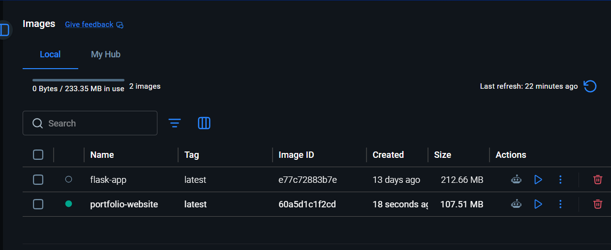
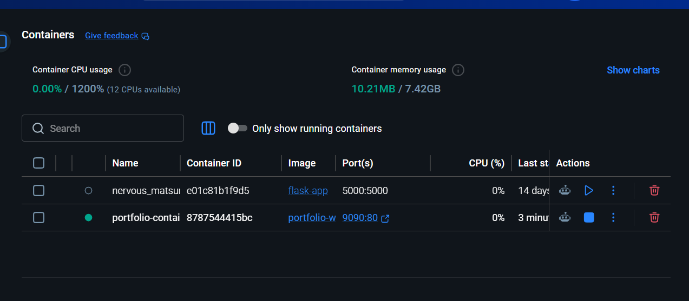
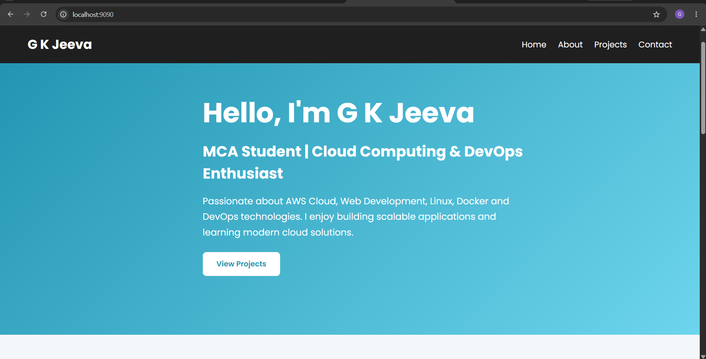
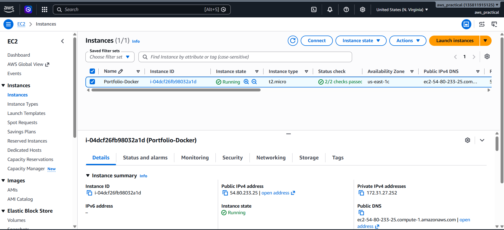
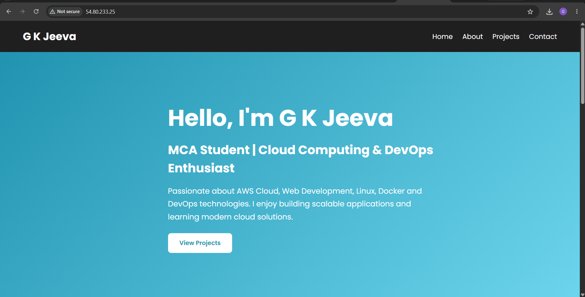

# Dockerized Portfolio Website Deployment on AWS EC2

Public URL: http://54.80.233.25

## Technologies Used

* Docker
* Nginx
* AWS EC2 (Ubuntu)
* GitHub

## Steps Performed

1. Created a Dockerfile.
2. Built the Docker image.
3. Ran the Docker container locally.
4. Created an AWS EC2 Ubuntu instance.
5. Installed Docker on EC2.
6. Cloned the GitHub repository.
7. Built and ran the Docker container on EC2.
8. Accessed the website using the Public IP address.

## Commands Used

docker build -t portfolio-website .

docker run -d -p 9090:80 portfolio-website

sudo docker build -t portfolio-website .

sudo docker run -d -p 80:80 portfolio-website

## Screenshots

### Docker Images

### Running Container

### Website Running Locally

### EC2 Instance Running

### Website Running on AWS

